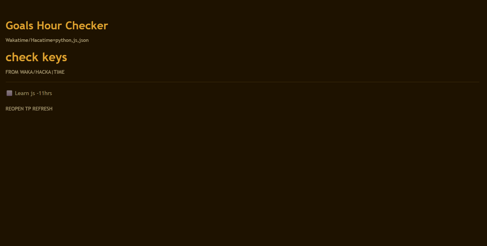

# GOAL-Time-Checker

## WHAT IS IT ?

IT IS  A VSCODE EXTENSION WHICH USES THE WAKATIME API KEYS TO CONFIGURE YOUR HOURS

YOU SET SOME GOALS LIKE-
LEARN BINARY 
COMPLETE 35 YSWS HOURS
CODE 1 HOUR
ETC.

AND CONFIGURATION FROM WAKATIME FILLS YOUR HOURS AND AUTO CHECKS YOUR GGOAL 

IT IS A FIRST RELEASE SO YOU CANNOT ASSUME IT IS RELIABLE BUT STILL IT HELPS FOR TIME MANAGEMENT AND ALSO DO NOT REQUIRE A HOUR TO SETUP

## WHAT IT IS MADE OF-

IT IS MADE FROM--
        JSON FILES Like-
            Data.json for api and goal setup
            Launch.json for VSCODE support and configuration for extension development path as earlier i used cursor .
            package.json it contains basic paths version commands and etc.

        HTML FILE FOR WEBVIEW-
            Panel.html with inline styling and i created seperate css but was very headache

        Javascript file for Extension Connection and python calls and i was a learner too so dont mind

        Python file for backend and javascript supporter and api fetcher.

# GOALS-

My goals for this are unlimited i will try to add other apis sonnect directly to websites implement in computer lab of my scholl and many more.

# HOW TO RUN

. Clone this repo
2. Open the folder in VS Code
3. Press F5 to launch
4. In the new window, press Ctrl+Shift+P
NOTE-YOU HAVE TO SET UP YOUR API KEY ,GET IT AT-`https://wakatime.com/settings/account`
5. Run Tracker: Set Wakatime Key— paste your API key
6. Run Tracker: Add Goal — set a goal
7. Run Tracker: Show Panel — see your progress

#  REQUIREMENTS

-- VS CODE 1.80+
-- PYTHON 3 INSTALLED
--WAKATIME/HACKATIME API KEY 

GALLERY-

# NOTES-

THIS VERSION COULD BE BUGGY AS I WAS LEARNING SOMETHINGS AND WAS THE FIRST RELEASE OF MINE IN EXTENSIONS

I USED AI FOR VS CODE DOCS SYNC TO EXTENSION.JS NOT EVERY FIELD BUT  3 TO 4 AS THEY WERE VERY CONFUSING
WHEN I GOT STUCK SO IT TOLD ME SOME EASY SOLUTION SO I DON TWASTE MY HOURS
2 TO 3 FIXES IN PYTHON
COULD BE 1 OR 2 MORE I DONT REMEMBER EXACTLY

## THANKS TO HORIZONS REVIEW TEAM 

# SEE THIS VIDEO TOO

